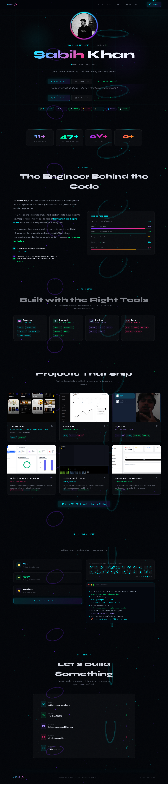
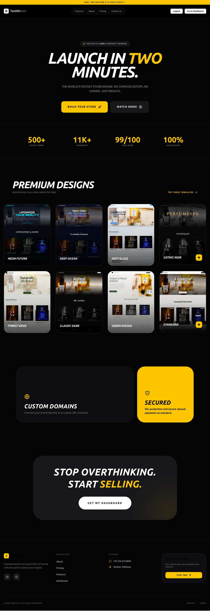
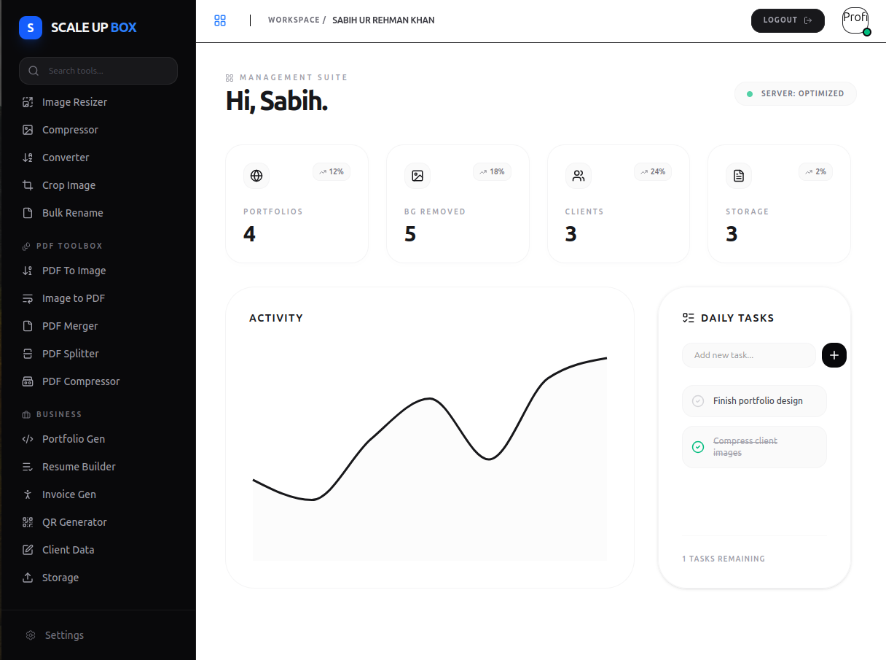
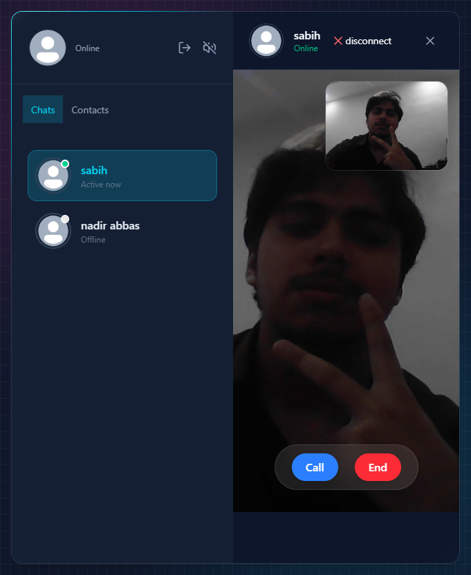
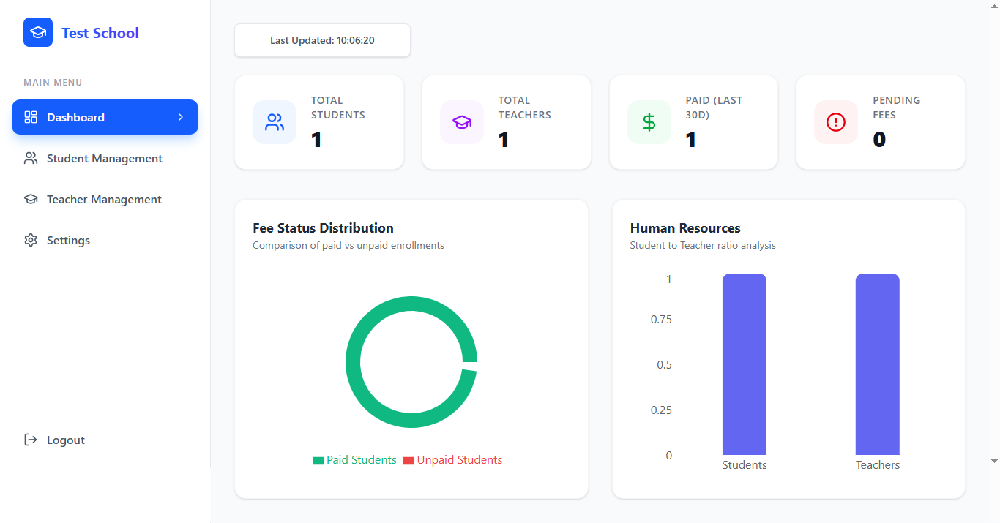
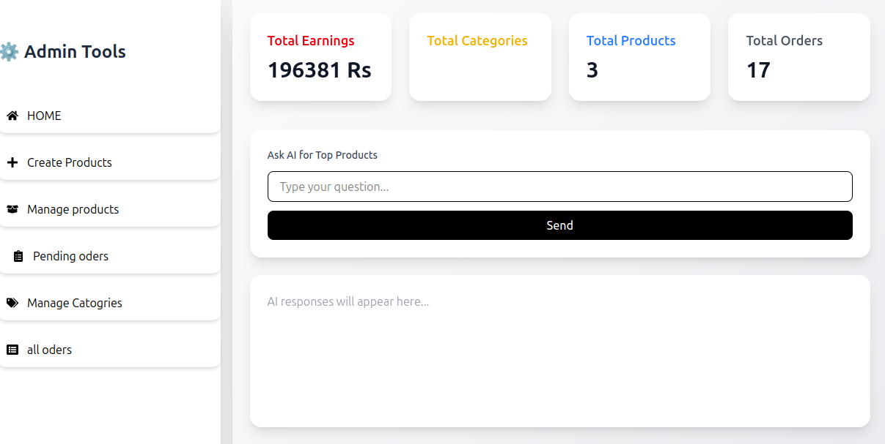

# 🚀 Sabih Khan – Developer Portfolio

Welcome to my personal developer portfolio — a modern, animated, and fully responsive showcase of my work as a **Full-Stack Software Engineer**.

---

## ✨ About This Portfolio

This portfolio is designed with a focus on **modern UI/UX, smooth animations, and clean design principles**. It represents my journey as a developer and highlights my projects, skills, and engineering mindset.

Built to reflect:
- ⚡ Modern frontend engineering
- 🎨 Smooth animations & interactive UI
- 📱 Fully responsive design
- 🧠 Clean and scalable code structure

---

## 🖼️ Portfolio Preview

### Hero Section

### Projects Showcase

| Project | Preview |
|----------|--------|
| TwoMinSite |  |
| ScaleUpBox |  |
| ChillChat |  |
| CodeEditor Web |  |
| School Management SaaS |  |
| E-commerce Platform |  |

---

## 🧑‍💻 Tech Philosophy

This portfolio is built with a focus on:
- Performance-first UI design
- Smooth animations and transitions
- Real-world SaaS-style presentation
- Developer-centric storytelling

---

## 🛠️ Technologies Used

- HTML5
- CSS3
- JavaScript
- TailwindCSS (if used)
- Modern animation techniques

---

## 📌 Features

- 🎬 Animated UI/UX design
- 🌐 Fully responsive layout
- ⚡ Fast loading performance
- 🎯 Project-based structure
- 🧩 Clean reusable components

---

## 👨‍💻 Author

**Sabih Khan**  
Full-Stack Software Engineer  
Passionate about building scalable web applications, SaaS platforms, and modern UI systems.

---

## 📫 Contact

- GitHub: https://github.com/sabihkahn  
- Email: sabihkhan.dev@gmail.com  
- LinkedIn: linkedin.com/in/sabihkhan-dev  

---

## ⭐ Note

This portfolio is continuously evolving as I learn and build more advanced systems in **Full-Stack Development, DevOps, and System Design**.

---

